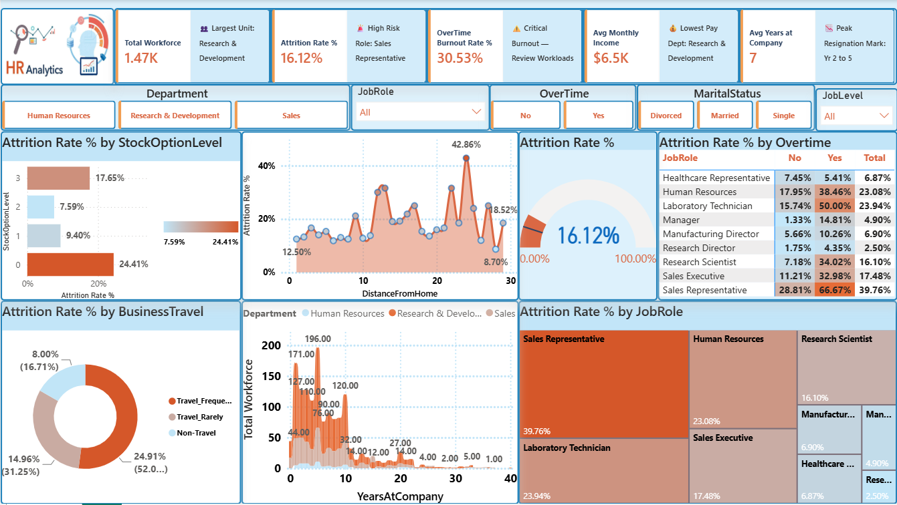

# 👥 Enterprise HR Workforce Retention & Attrition Analytics Suite
> **An AI-Ready, Self-Explaining Executive BI Dashboard Engineered for Instant Root-Cause Workforce Diagnostic & C-Suite Decision Making.**


---


---

## 📌 Executive Summary
Traditional Human Resources dashboards report historical turnover counts but fail to show leadership **why** top talent is leaving or **where** to intervene. 

This project transforms standard reporting into an **Interactive Workforce Retention Engine** based on the industry-benchmark **IBM HR Attrition Dataset (1,470 Employees | 16.12% Overall Attrition)**. Engineered with custom-coded **Dynamic DAX Action Subtitles**, the dashboard automatically rewrites plain-English executive takeaways whenever a user filters by department, job role, overtime status, or tenure.

---

## 🔥 The Dynamic Difference: Self-Explaining C-Suite KPIs
Instead of static numeric cards, the top **6-in-1 Executive KPI Strip** uses advanced DAX logic to expose root-cause operational risks in real time:

| KPI Metric | Standard Static Dashboard ❌ | Our Dynamic Decision Engine ✔️ |
| :--- | :--- | :--- |
| **Total Workforce** | `1.47K` | **`👥 Largest Unit: Research & Development`** |
| **Attrition Rate %** | `16.12%` | **`🚨 High Risk Role: Sales Representative`** |
| **OverTime Burnout Rate** | `30.53%` | **`⚠️ Critical Burnout — Review Workloads`** |
| **Avg Monthly Income** | `$6.5K` | **`💰 Lowest Pay Dept: Research & Development`** |
| **Avg Years at Company** | `7 Years` | **`📉 Peak Resignation Mark: Yr 2 to 5`** |

> *No manual interpretation required: Clicking any slicer automatically updates the action subtitles to reveal hidden turnover risks within specific teams.*

---

## 💡 Top 3 Executive Workforce Takeaways

### 1. The OverTime Burnout Crisis (Sales Representatives)
* Employees working OverTime exhibit a **30.53% Attrition Rate** compared to baseline tolerance.
* **Critical Risk Area:** **Sales Representatives working OverTime reach an alarming 66.67% Attrition Rate**—proving that unchecked workloads directly destroy salesforce continuity.
* **Strategic Takeaway:** Cap OverTime hours for frontline sales staff and redistribute lead quotas immediately.

### 2. The Commuting Misery Threshold (Distance vs. Turnover)
* The **Area Chart Mountain** reveals a sharp resignation surge as commute distance exceeds 10–15 miles, peaking at **42.86% Attrition around the 24-mile mark**.
* **Strategic Takeaway:** Turnover in long-commute employees is driven by travel fatigue rather than compensation. Introduce hybrid work policies or targeted transit allowances for staff commuting over 15 miles.

### 3. The Ownership Anchor (Stock Options as a Retention Lock)
* Employees with **Level 0 Stock Options** suffer a **24.41% Attrition Rate**.
* Providing even an entry-level equity stake (**Level 1 Stock Options**) cuts turnover down to **7.59%**.
* **Strategic Takeaway:** Expanding micro-equity or profit-sharing programs to Year-2 employees is the most cost-effective retention lever in the enterprise.

---

## 📐 Dashboard Visual Architecture
* **Top Ribbon:** 6-in-1 Dynamic Multi-Card with contextual DAX decision lines.
* **Command Slicer Strip:** Horizontal filtering across `Department`, `JobRole`, `OverTime`, `MaritalStatus`, and `JobLevel`.
* **Top Left (Area Chart Mountain):** `DistanceFromHome` vs. `Attrition Rate %` identifying commuting fatigue thresholds.
* **Top Right (Heatmap Matrix):** Two-dimensional risk scanner correlating `JobRole` against `OverTime` status.
* **Center Left (Funnel Chart):** Impact of `StockOptionLevel` on employee retention.
* **Center Right (Speedometer Gauge):** Live visual benchmark monitoring actual Attrition (`16.12%`) against a `10.00%` corporate target.
* **Bottom Left (Donut Chart):** Resignation distribution across `BusinessTravel` frequency tiers.
* **Bottom Right (Treemap):** Size-and-color coded hierarchy showing overall share of Attrition by Job Role.

---

## 📁 Repository Structure
```text
├── hr_analytics_dashboard.pbix             # Main Power BI Desktop file with complete DAX data model
├── hr_analytics_dashboard_demoVideo.mp4    # 40-second interactive video demonstration of dynamic filters
├── hr_analytics_dashboard_screenshot.png   # High-resolution executive preview screenshot
├── WA_Fn-UseC_-HR-Employee-Attrition.csv   # Raw IBM HR Analytics employee attrition dataset
└── README.md                               # Project documentation & executive findings
